# Smart Icheon Care

CCTV 객체 탐지와 공공데이터를 이어, 넓은 행정구역을 제한된 인력으로 관리하는 도시 인프라 통합 관리 시스템입니다.

**제2회 파이썬 SW 활용 경진대회** · **2026 지능형 로봇 컨소시엄 창의융합캠프** · 광운대학교 정보융합학부 이지우

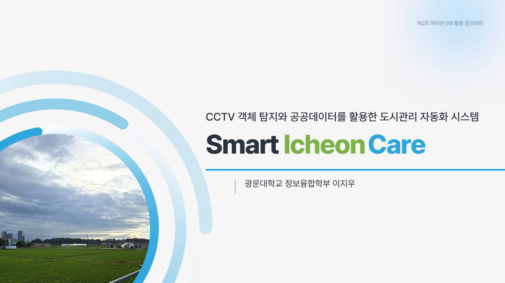

본 프로토타입은 이천시 도시관리 자동화 데모입니다. CV는 현수막 **존재**를 찾고, 공공데이터 Risk로 **불법 의심**을 제안하며, 최종 확정(`CONFIRMED`)은 공무원만 합니다. AI Hub 학습 가중치(`.pt`)는 저장소에 포함하지 않습니다. 라이브 RTSP는 미연동이며, `/cctv` 업로드 추론으로 파이프라인을 시연합니다.

설계 원칙은 하나입니다. **되돌릴 수 있는 곳(탐지·선별·설명)엔 AI를, 되돌릴 수 없는 곳(승인·철거 확정)엔 사람(Human-in-the-loop)을.**

```bash
npm install && npm run dev          # 웹 → http://localhost:3000
# 별도 터미널 (CV API)
cd platform && PYTHONPATH=. uvicorn backend.app.main:app --host 127.0.0.1 --port 8000
```

먼저 보실 것 — `/cctv`에서 이미지 탐지 → 박스 클릭(2차 OCR 검사) → 이벤트 상태 `CONFIRMED`.  
모델·실험 정본: [`platform/artifacts/BANNER_MODEL_CARD.md`](platform/artifacts/BANNER_MODEL_CARD.md)

---

## 한 줄로

> 민원 발생 후 전수 순찰하던 행정을, **AI가 먼저 찾고 Risk로 줄 세운 뒤 공무원이 확정**하는 구조로 바꿉니다.

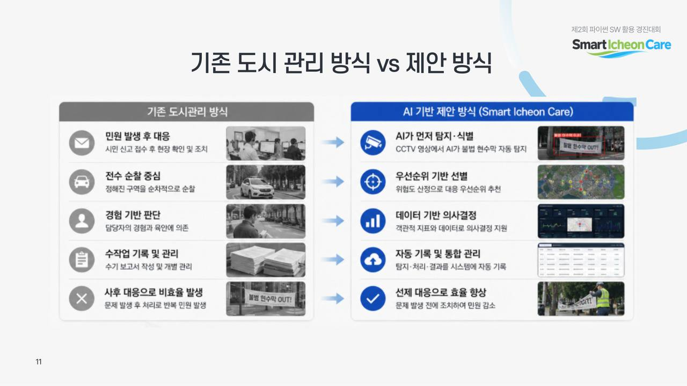

| 기존 | Smart Icheon Care |
|------|-------------------|
| 민원 후 대응 | AI가 먼저 탐지·식별 |
| 전수 순찰 | Risk·Priority 기반 선별 |
| 경험 기반 판단 | 공공데이터·정본 대조 |
| 수작업 기록 | 이벤트 자동 기록·상태 머신 |
| 사후 대응 | 선제 후보 제시 → 사람 확정 |

---

## 왜 이천인가

현장 인터뷰와 관찰에서 제설·불법 현수막·신호등 방치 등이 따로 보였지만, 공통 뿌리는 **통합적 시설 관리의 부족**입니다.

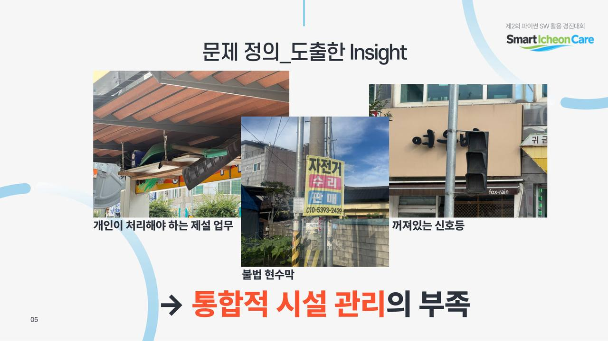

이천은 도심·농촌·산업이 분산된 **461.3km²** 규모로, 공무원 1인당 담당 면적이 서울 대비 약 **25.3배**, 수원 대비 약 **11배**입니다. 순찰만으로는 상시 점검이 어렵고, 조사 시간을 줄여 **실질적 집행**에 인력을 써야 합니다.

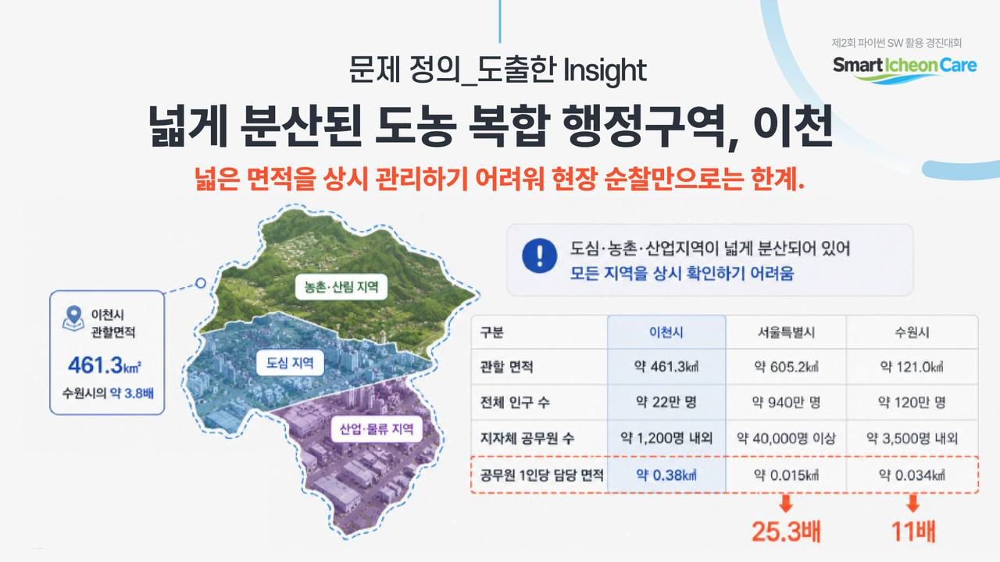

대표 Persona(이천시 공무원)가 필요로 하는 것은 실시간 현장 파악, 민원 한눈에 보기, 체계적 의사결정 지원 — 그 결과가 **실질적 집행**입니다.

---

## 세 개의 숫자

| | 뜻 |
|---|---|
| **모델 · 공통테스트** | Precision **0.633** · Recall **0.555** · mAP50 **0.439** (30ep, 10ep 대비 전 지표 상승) |
| **속도** | Apple Silicon MPS ≈ **15.7 FPS** (≈64 ms) · CPU ≈ 4.2 FPS |
| **행정 원칙** | 탐지≠확정. Risk≥70 → `불법의심`, 최종은 공무원 `CONFIRMED` |

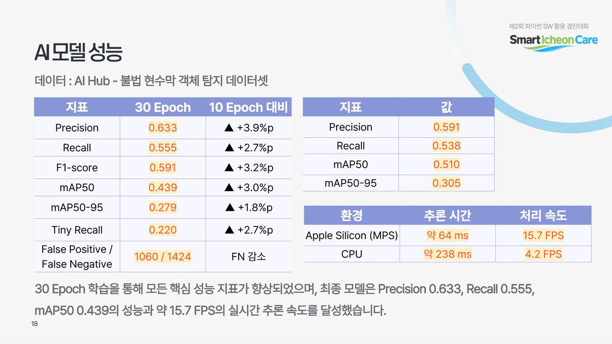

공개 **illegal/legal YOLO 2클래스** 라벨이 없어 픽셀만으로 불법을 학습하지 않습니다. 제품은 **옵션1**: 존재 탐지 + Risk 의심 + (클릭) OCR 내용 검사입니다.

---

## 화면 흐름 — 데모 6막

`npm run dev` + FastAPI `:8000` · `/cctv` · 권장 테스트 이미지 `platform/datasets/banner_mvp_all/images/val/*.jpg`

### 1막 — 업로드하면 박스가 생긴다

카메라·conf를 고르고 이미지/영상을 올리면 YOLO11s가 현수막을 찾고, 미리보기에 박스가 그려집니다.

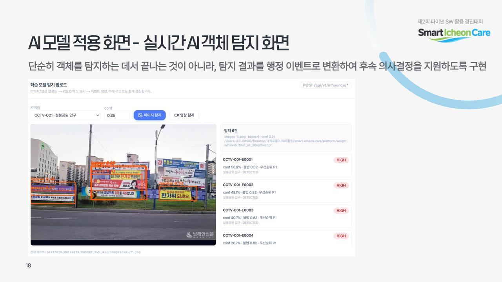

### 2막 — Risk가 줄 세운다

탐지 결과는 CCTV 근사좌표·허가·민원·보호구역 등과 Join되어 Risk/Priority가 붙고, `ILLEGAL_SUSPECT` / `LOW_RISK`로 표시됩니다.

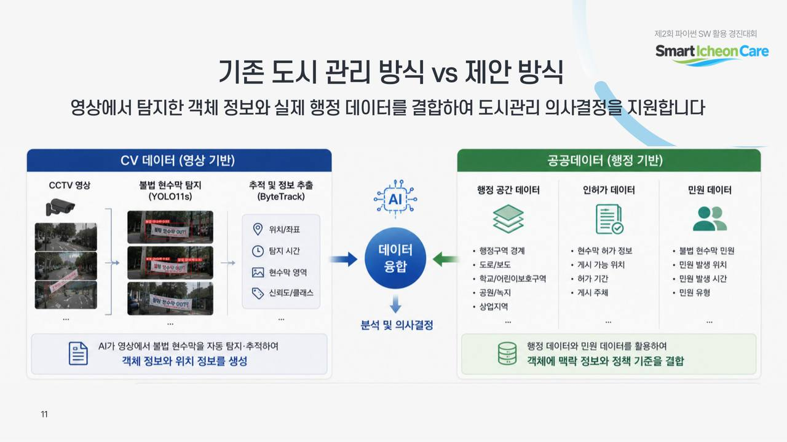

### 3막 — 박스를 클릭하면 2차 검사

선택한 bbox만 크롭해 OCR·금칙어·허가번호·마크 휴리스틱으로 `content_verdict`를 냅니다.  
API: `POST /api/v1/inference/inspect`

### 4막 — 공무원이 확정한다

이벤트 상세에서 `DETECTED → REVIEW_PENDING → CONFIRMED → … → RESOLVED` (또는 `DISMISSED`). 상태 전이는 단방향입니다.

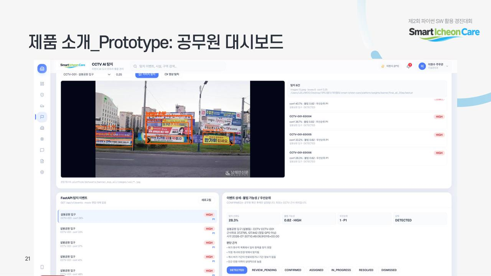

### 5막 — 대시보드에서 도시를 본다

VWorld 지도·주차 핫스팟·시설 우선순위·AI 추천이 한 화면에 모입니다.

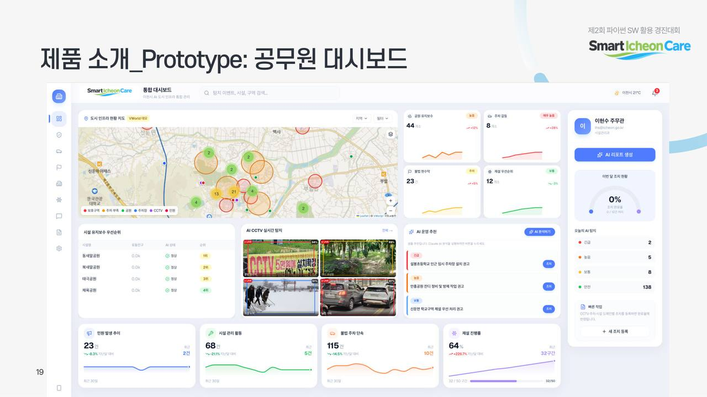

### 6막 — 파이프라인 전체가 이어진다

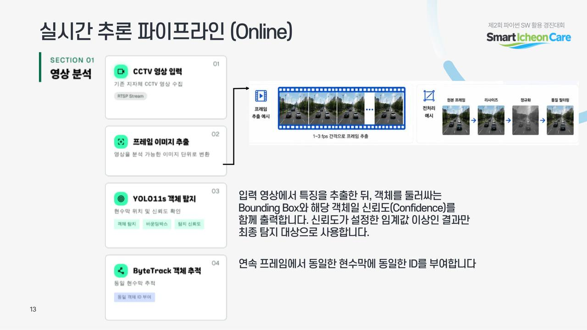

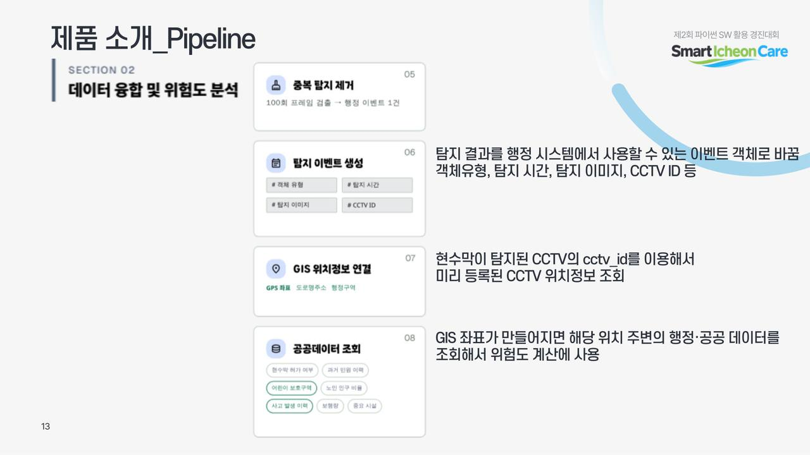

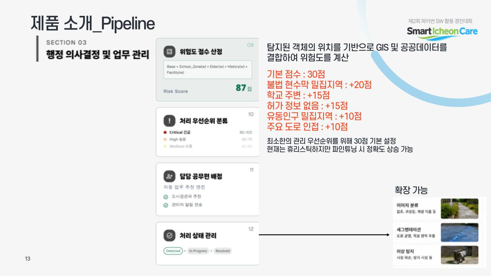

```text
CCTV/업로드 → 프레임 → YOLO11s → ByteTrack
  → Event → GIS → 공공데이터 Join → Risk/Priority → illegal_candidate
  → (클릭) OCR 내용 검사 → Dashboard → Officer CONFIRMED
```

---

## CV · 학습 (Offline)

AI Hub 종합 민원 이미지 현수막 카테고리 → YOLO 포맷 정제 → Train/Val/Common Test → YOLO11s 30ep (`imgsz=640`) → `best.pt` → 서비스 추론.

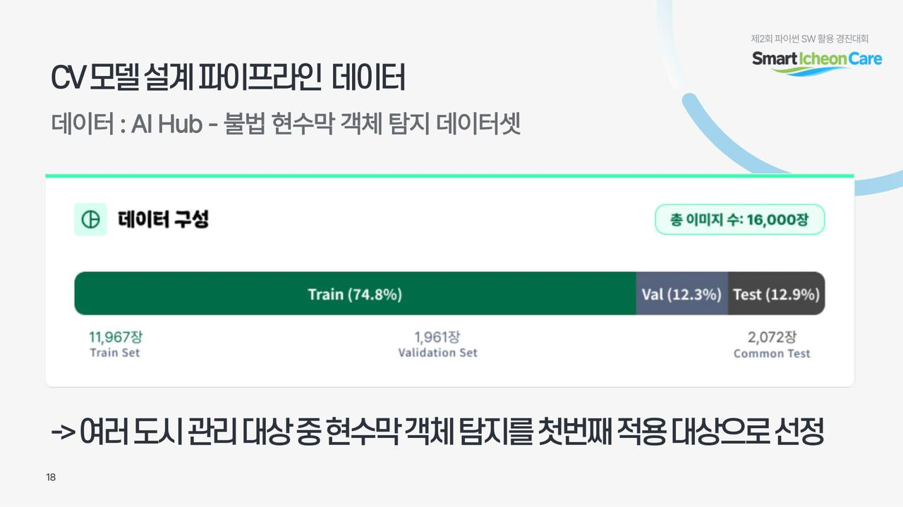

| 분할 | 규모 (MVP) |
|------|------------|
| Train | ≈ 11,967 |
| Val | ≈ 1,961 |
| Common Test | ≈ 1,892~2,072 |

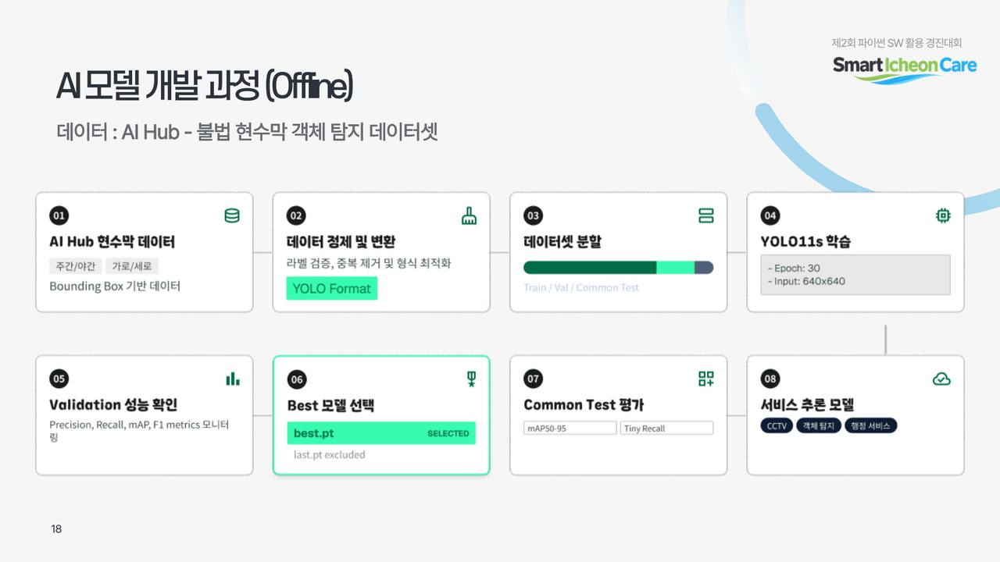

가중치 경로(로컬): `platform/weights/banner/final_all_30ep/best.pt`  
실험·한계 상세: [`platform/artifacts/BANNER_MODEL_CARD.md`](platform/artifacts/BANNER_MODEL_CARD.md)

---

## 공공데이터 근거

Risk·지도 레이어는 공개 표준·시 제공 CSV를 JSON으로 정규화합니다.

- 어린이·노인·장애인 보호구역 → `facilityType`, `lat`/`lng`, 반경 ≈ `roadWidth × 15m`
- 전국 주차장·도시공원 표준 → 이천시 필터 (`name`, `spaces`, `area` 등)
- 허가·민원·CCTV 현황 → Risk 가산점(허가 없음, 보호구역 인접, 민원 이력 등)

휴리스틱 예시(발표 기준): Base 30 + 밀집 +20 + 학교 +15 + 허가없음 +15 + 유동인구 +10 + 주요도로 +10 → Critical 80–100 / High 60–79 / Medium 40–59.

---

## 보장 — 제품 원칙

| 원칙 | 어디서 |
|------|--------|
| CV는 존재만 주장 | YOLO 단클래스 `banner` |
| 불법은 의심 배지 | Risk≥70 → `ILLEGAL_SUSPECT` |
| 내용 검사는 선택 | `/inference/inspect` · easyocr 없으면 `NEEDS_REVIEW` |
| 확정은 사람만 | `CONFIRMED` · `platform/event/workflow.py` |
| 이벤트 필터 | `GET /api/v1/events?illegal_only=true` |

---

## 실행

### 웹 (Next.js)

```bash
cp .env.example .env.local   # NEXT_PUBLIC_VWORLD_API_KEY (없으면 VWorld 데모 타일)
npm install
npm run dev                  # http://localhost:3000
```

| 경로 | 설명 |
|------|------|
| `/dashboard` | GIS 지도, AI 리스크, 시설 테이블 |
| `/parking-analysis` | 주차 갈등 히트맵·핫스팟 |
| `/cctv` | 불법 현수막(의심) 탐지 · 클릭 OCR · 우선순위 큐 |
| `/mobile` | 시민 신고·민원 |

### CV API (`platform/`)

```bash
cd platform
python -m venv .venv && source .venv/bin/activate
pip install -r requirements.txt
MUNICIPAL_PUBLIC_DATA=fixtures/demo_public_data \
MUNICIPAL_EVENTS_DB=artifacts/events.db \
PYTHONPATH=. uvicorn backend.app.main:app --host 127.0.0.1 --port 8000
```

```bash
# Risk 스모크 (GPU 불필요)
PYTHONPATH=. python scripts/demo_risk.py
pytest -q
```

---

## 구조

```
src/app/                 # Next.js 화면
src/components/          # dashboard · parking · cctv · map · mobile
src/lib/vision-api.ts    # FastAPI 클라이언트 (infer · inspect · events)
platform/
  inference/             # YOLO + ByteTrack 파이프라인
  content/               # 2단계 OCR·키워드·마크 검사
  risk/                  # Risk / Priority
  event/                 # 상태 머신
  backend/app/           # FastAPI
  artifacts/             # 모델카드 · 실험 리포트
docs/
  readme-assets/         # 발표 PDF 발췌 이미지 (이 README)
  pitch-slides/          # 전체 슬라이드 렌더
  banner-detection-design.md
```

---

## 기대 효과

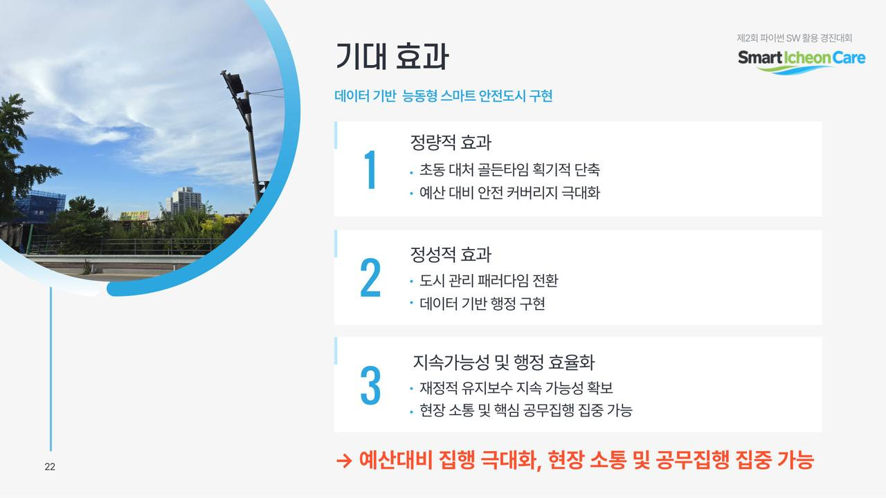

- **정량**: 초동 골든타임 단축 · 예산 대비 안전 커버리지
- **정성**: 사후 민원 → 선제 후보 제시 · 데이터 기반 행정
- **지속**: 조사 부담을 줄여 현장 소통과 핵심 집행에 집중
- **SDGs**: 9(혁신·인프라) · 11(지속가능 도시) · 16(투명한 제도)

전국 도농복합시·군으로 확장 가능한 패턴을 이천에서 먼저 검증합니다.

---

## 만들지 않은 것 / 한계

- 라이브 RTSP 상시 연동, 실채널 철거 발주 시스템
- illegal/legal 픽셀 분류기(공개 라벨 부재)
- OCR은 야간·각도·저해상도에서 실패 가능 → `NEEDS_REVIEW`
- Tiny object recall ≈ 0.22 — 원거리 소형 현수막 누락 가능
- `.pt` 가중치·대용량 데이터셋은 git 제외 (로컬 전달)

FAQ(발표): 기존 CCTV·민원 미디어를 활용하고, 새 업무를 만들기보다 **기존 단속·시설·민원 업무를 AI가 보조**합니다.

---

## 문서

| 문서 | 내용 |
|------|------|
| [`platform/README.md`](platform/README.md) | CV/MLOps 플랫폼 진입점 |
| [`platform/artifacts/BANNER_MODEL_CARD.md`](platform/artifacts/BANNER_MODEL_CARD.md) | 모델·성능·HITL 정의 |
| [`platform/docs/RESEARCH_INDEX.md`](platform/docs/RESEARCH_INDEX.md) | 연구 산출물 인덱스 |
| [`docs/banner-detection-design.md`](docs/banner-detection-design.md) | 설계 요약 |
| [`docs/pitch-slides/`](docs/pitch-slides/) | 발표자료 전체 슬라이드 이미지 |
| 원본 PDF | `이천스마트케어_발표자료` (로컬 Downloads) |

## Tech Stack

- **Web**: Next.js 16 · React 19 · TypeScript · Tailwind · Leaflet + VWorld · Recharts  
- **CV**: Ultralytics YOLO11s · ByteTrack · FastAPI · (optional) easyocr  
- **Data**: 공공데이터 CSV → JSON · Risk/Priority 규칙 엔진
